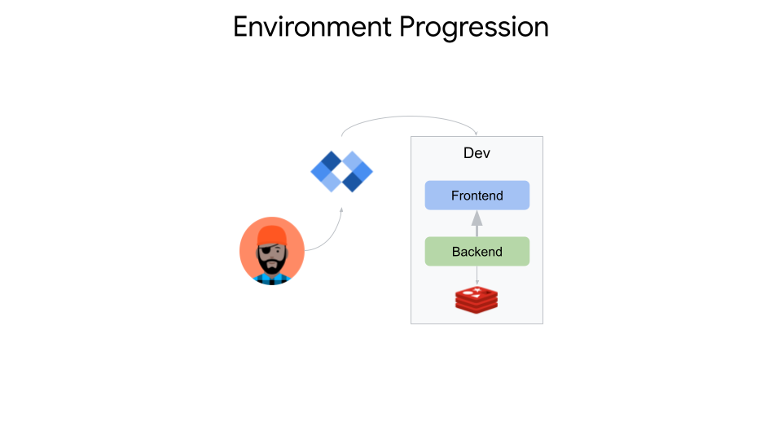
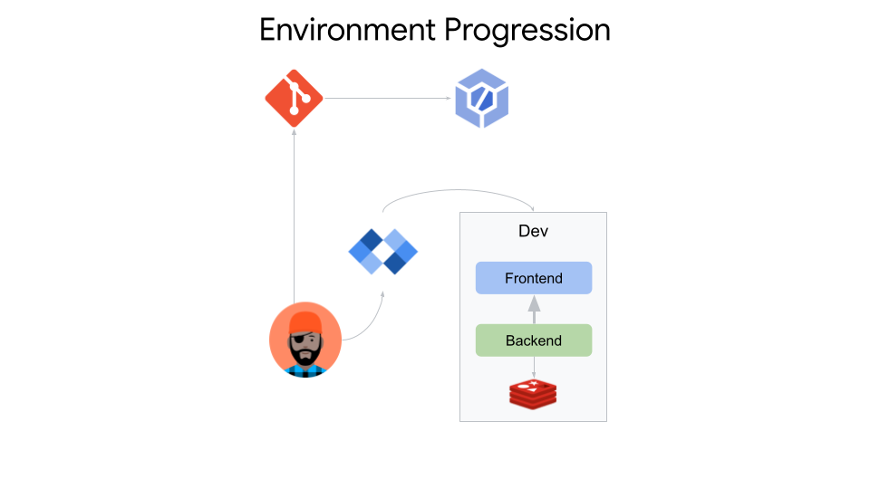
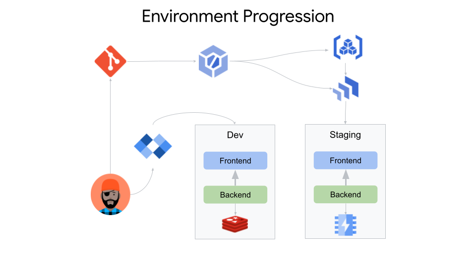
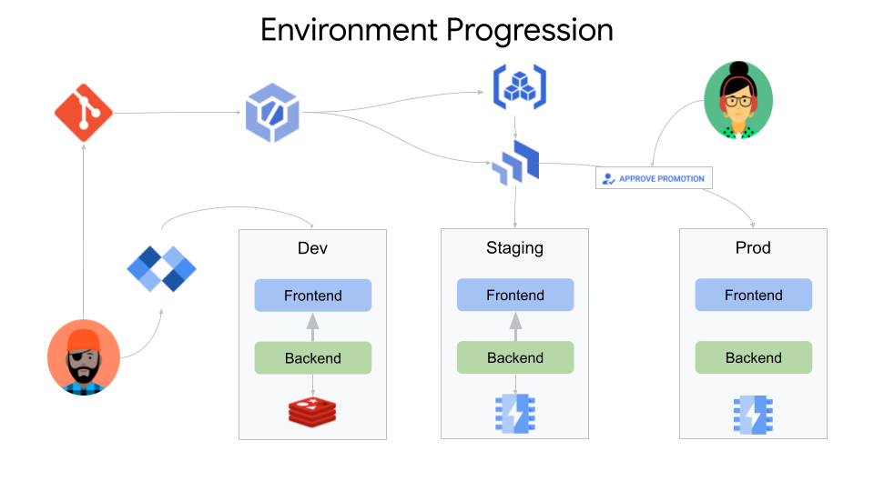

# Sample App For End to End Golden Path

## Boostrapping your project

0. Run `./demo-startup.sh` to prepare the environment
0. Auto-generate the skaffold config and kubernetes deployment manifest and enter **8080** when asked about the port.
    ```
    skaffold init --generate-manifests
    ```
0. Add the following YAML to the end of **deployment.yaml** to ensure redis is properly deployed and rbac is configured
    ```
    ---
    apiVersion: apps/v1
    kind: Deployment
    metadata:
      name: redis
    spec:
     selector:
       matchLabels:
         app: redis
     template:
      metadata:
         name: redis
         labels:
           app: redis
      spec:
        containers:
        - name: redis
          image: redis:5.0.4
          command:
            - redis-server
          env:
          - name: MASTER
            value: "true"
          ports:
          - containerPort: 6379
          resources:
            limits:
              cpu: "0.3"
          volumeMounts:
          - mountPath: /redis-master-data
            name: data
        volumes:
          - name: data
            emptyDir: {}
    ---
    kind: Service
    apiVersion: v1
    metadata:
      name: redis
    spec:
      ports:
        - name: redis
          port: 6379
          protocol: TCP
      selector:
        app: redis
    ---
    apiVersion: rbac.authorization.k8s.io/v1
    kind: Role
    metadata:
      namespace: default
      name: info-getter
    rules:
      - apiGroups: [""] # "" indicates the core API group
        resources: ["pods"]
        verbs: ["get"]
      - apiGroups: ["redis.cnrm.cloud.google.com"]
        resources: ["redisinstances"]
        verbs: ["get", "list"]
    ---
    apiVersion: rbac.authorization.k8s.io/v1
    kind: RoleBinding
    metadata:
      name: get-info
      namespace: default
    subjects:
      # You can specify more than one "subject"
      - kind: ServiceAccount
        name: default # "name" is case sensitive
    roleRef:
      # "roleRef" specifies the binding to a Role / ClusterRole
      kind: Role #this must be Role or ClusterRole
      name: info-getter # this must match the name of the Role or ClusterRole you wish to bind to
      apiGroup: rbac.authorization.k8s.io
    ```
0. Edit **skaffold.yaml** and add testing between the build and deploy YAML so the file looks like this
    ```
    build:
    ...
    test:
    - image: go-mod-image
      custom:
      - command: go test
    deploy:
    ...
    ```
0. On the bar at the absolute bottom of the IDE, click Cloud Code > Run on Kubernetes and watch the app build and deploy to minikube in the console output
0. See the app running at http://localhost:8080
0. Open **main.go** and change the value of `var color` to blue/red and watch the app rebuild in the console output
0. See the change running at http://localhost:8080
0. You can debug the app by doing the following:
    * Click the Cloud Code stop button at the top of the IDE
    * Open **main.go** and add a breakpoint on the line `counter, err := incrCounter(c)`
    * On the bar at the absolute bottom of the IDE, click Cloud Code > Debug on Kubernetes

Your app is now deployed locally on minikube with redis.



## Configure Cloud Build Trigger

0. Log into GitHub, fork this repository, and follow [these](https://cloud.google.com/build/docs/automating-builds/build-repos-from-github#installaing_gcb_app) steps to connect the forked repository to Cloud Build
0. Create a file called **cloudbuild.yaml** and add the following to it:
    ```
    substitutions:
      _REGION: us-central1
    steps:
    - name: 'gcr.io/k8s-skaffold/skaffold'
      entrypoint: 'sh'
      args:
      - -xe
      - -c
      - |
        # Build and push images
        skaffold build --file-output=/workspace/artifacts.json \
                       --default-repo=${_REGION}-docker.pkg.dev/$PROJECT_ID/sample-app-repo \
                       --push=true
    
        # Test images
        skaffold test --build-artifacts=/workspace/artifacts.json
    
    - name: 'google/cloud-sdk:latest'
      entrypoint: 'sh'
      args:
      - -xe
      - -c
      - |
        gcloud alpha deploy releases create $SHORT_SHA-$(date +%s) \
                            --delivery-pipeline sample-app \
                            --description "$(git log -1  --pretty='%s')" \
                            --region ${_REGION} \
                            --build-artifacts /workspace/artifacts.json
    artifacts:
      objects:
        location: 'gs://$PROJECT_ID-gceme-artifacts/'
        paths:
        - '/workspace/artifacts.json'
    options:
      machineType: E2_HIGHCPU_8
    timeout: 3600s
    ```
0. Create the Cloud Build trigger for whenever a push is made to the main branch
    ```
    gcloud beta builds triggers create github \
        --name="sample-app-repo" \
        --repo-owner="willisc7" \
        --repo-name="sample-app" \
        --branch-pattern="main" \
        --build-config="cloudbuild.yaml"
    ```

You now have Cloud Build configured for continuous integration.



## Configure Cloud Deploy and Rollout to Staging

0. Create the deployment manifest for the staging environment
    ```
    cp deployment.yaml deployment-staging.yaml
    ```
0. Edit **deployment-staging.yaml** and remove the redis service and deployment sections shown below
    ```
    ---
    apiVersion: apps/v1
    kind: Deployment
    metadata:
      name: redis
    spec:
     selector:
       matchLabels:
         app: redis
     template:
      metadata:
         name: redis
         labels:
           app: redis
      spec:
        containers:
        - name: redis
          image: redis:5.0.4
          command:
            - redis-server
          env:
          - name: MASTER
            value: "true"
          ports:
          - containerPort: 6379
          resources:
            limits:
              cpu: "0.3"
          volumeMounts:
          - mountPath: /redis-master-data
            name: data
        volumes:
          - name: data
            emptyDir: {}
    ---
    kind: Service
    apiVersion: v1
    metadata:
      name: redis
    spec:
      ports:
        - name: redis
          port: 6379
          protocol: TCP
      selector:
        app: redis
    ```
0. Still editing **deployment-staging.yaml**, add the following YAML to the end of the file to deploy a redis in GCP using GCP Config Connector
    ```
    ---
    apiVersion: redis.cnrm.cloud.google.com/v1beta1
    kind: RedisInstance
    metadata:
      name: redis
    spec:
      displayName: Redis Instance
      region: us-central1
      authorizedNetworkRef:
        name: default
      tier: BASIC
      memorySizeGb: 16
      connectMode: PRIVATE_SERVICE_ACCESS
    ```
0. Edit **skaffold.yaml** and add the staging, canary, and prod profiles to the end of the file
    ```
    profiles:
    - name: staging
      deploy:
        kubectl:
          manifests:
          - deployment-staging.yaml
    - name: canary
      deploy:
        kubectl:
          manifests:
          - deployment-canary.yaml
    - name: prod
      deploy:
        kubectl:
          manifests:
          - deployment-prod.yaml
    ```
0. Create a file called **pipeline.yaml** and add the following YAML to it. This will be the pipeline for deploying to staging and prod
    ```
    apiVersion: deploy.cloud.google.com/v1beta1
    kind: DeliveryPipeline
    metadata:
      name: sample-app
      labels:
        app: sample-app
    description: sample-app delivery pipeline
    serialPipeline:
      stages:
      - targetId: staging
        profiles:
        - staging
      - targetId: canary
        profiles:
        - canary
      - targetId: prod
        profiles:
        - prod
    ```
0. Create the Cloud Deploy pipeline
    ```
    gcloud alpha deploy apply --region us-central1 --file ./pipeline.yaml
    ```
0. Create the staging deployment file called **staging-deploy.yaml** replacing `PROJECT_NAME` with your GCP project
    ```
    apiVersion: deploy.cloud.google.com/v1beta1
    kind: Target
    metadata:
      name: staging
      annotations: {}
      labels: {}
    description: staging
    gkeCluster:
      project: PROJECT_NAME
      cluster: staging
      location: us-central1
    ```
0. Configure the staging step of the CD pipeline
    ```
    gcloud alpha deploy apply --region us-central1 --file ./staging-deploy.yaml
    ```
0. Trigger Cloud Build (CI) and Cloud Deply (CD) processes
    ```
    git add . && git commit -am "Trigger build and deploy to staging" && git push
    ```
0. Navigate to the [Cloud Build console](https://console.cloud.google.com/cloud-build) to watch the build and then the [Cloud Deploy console](https://console.cloud.google.com/deploy) to watch the deploy
0. You can check the app deployed in staging by running the following command and copy/pasting the link in the comment into your browser
    ```
    kubectl proxy --port 8001 --context gke_$(gcloud config get-value project)_us-central1_staging
    # http://localhost:8001/api/v1/namespaces/default/services/go-mod-image:8080/proxy/
    ```

You now have Cloud Build pushing artifacts to Artifact Registry and triggering a Cloud Deploy pipeline to deploy your application to the staging environment.



## Rollout to Canary and Prod
0. Create the canary and prod deployment manifests
    ```
    cp deployment-staging.yaml deployment-canary.yaml
    cp deployment-staging.yaml deployment-prod.yaml
    ```
0. Edit **deployment-canary.yaml** and **deployment-prod.yaml** and remove the redis YAML shown below. The canary deployment will use the prod version of redis and we will be spinning up the prod version of redis separately in a moment.
    ```
    apiVersion: redis.cnrm.cloud.google.com/v1beta1
    kind: RedisInstance
    metadata:
      name: redis
    spec:
      displayName: Redis Instance
      region: us-central1
      authorizedNetworkRef:
        name: default
      tier: BASIC
      memorySizeGb: 16
      connectMode: PRIVATE_SERVICE_ACCESS
    ```
0. Push the changes so Cloud Deploy can use these files
    git add . && git commit -am "Trigger build" && git push
    ```
0. Create a file called **redis.yaml** and paste the following YAML into it
    ```
    apiVersion: redis.cnrm.cloud.google.com/v1beta1
    kind: RedisInstance
    metadata:
      name: redis
    spec:
      displayName: Redis Instance
      region: us-central1
      authorizedNetworkRef:
        name: default
      tier: BASIC
      memorySizeGb: 16
      connectMode: PRIVATE_SERVICE_ACCESS
    ```
0. Deploy redis in prod before rolling out the canary deploy. In a real environment redis would already be in prod and you would not want to be automating the deployment alongside an application release.
    ```
    kubectl apply -f redis.yaml --context gke_$(gcloud config get-value project)_us-central1_prod
    ```
0. Watch until the prod deployment of redis has a `READY` status of `True`
    ```
    kubectl get redisinstances -w --context gke_$(gcloud config get-value project)_us-central1_prod
    ```
0. Create a file called **canary-deploy.yaml**. This will be the canary deployment configuration file. Copy the following YAML into it, replacing `PROJECT_NAME` with the appropriate name
    ```
    apiVersion: deploy.cloud.google.com/v1beta1
    kind: Target
    metadata:
      name: canary
      annotations: {}
      labels: {}
    description: canary
    gkeCluster:
      project: PROJECT_NAME
      cluster: prod
      location: us-central1
    ```
0. Create a file called **prod-deploy.yaml**. This will be the prod deployment configuration file. Copy the following YAML into it, replacing `PROJECT_NAME` with the appropriate name
    ```
    apiVersion: deploy.cloud.google.com/v1beta1
    kind: Target
    metadata:
      name: prod
      annotations: {}
      labels: {}
    description: prod
    requireApproval: true
    gkeCluster:
      project: PROJECT_NAME
      cluster: prod
      location: us-central1
    ```
0. Configure the canary and prod steps of the CD pipeline
    ```
    gcloud alpha deploy apply --region us-central1 --file ./canary-deploy.yaml
    gcloud alpha deploy apply --region us-central1 --file ./prod-deploy.yaml
    ```
0. Promote to canary. Hit **Enter** at the prompt.
    ```
    RELEASE_NAME=$(gcloud alpha deploy releases list --delivery-pipeline sample-app --region us-central1 --format json | jq -r '.[0].name' | cut -d '/' -f8)
    gcloud alpha deploy releases promote --release $RELEASE_NAME \
        --delivery-pipeline sample-app \
        --region us-central1
    ```
0. You can check the app deployed as a canary in prod by running the following command and copy/pasting the link in the comment into your browser
    ```
    kubectl proxy --port 8002 --context gke_$(gcloud config get-value project)_us-central1_prod
    # http://localhost:8002/api/v1/namespaces/default/services/go-mod-image:8080/proxy/
    ```
0. Navigate to the [Cloud Deploy console](https://console.cloud.google.com/deploy) and see that the canary deployment is green
0. Promote the app from canary to prod. Hit **Enter** at the prompt.
    ```
    RELEASE_NAME=$(gcloud alpha deploy releases list --delivery-pipeline sample-app --region us-central1 --format json | jq -r '.[0].name' | cut -d '/' -f8)
    gcloud alpha deploy releases promote --release $RELEASE_NAME \
        --delivery-pipeline sample-app \
        --region us-central1
    ```
0. Check the Cloud Deploy console again to see that the release is pending approval before it can be deployed to prod
0. Approve the rollout to prod
    ```
    RELEASE_NAME=$(gcloud alpha deploy releases list --delivery-pipeline sample-app --region us-central1 --format json | jq -r '.[0].name' | cut -d '/' -f8)
    ROLLOUT_NAME=$(gcloud alpha deploy rollouts list --delivery-pipeline sample-app --region us-central1     --release $RELEASE_NAME --format json | jq -r '.[0].name' | cut -d '/' -f10)
    gcloud alpha deploy rollouts approve $ROLLOUT_NAME \
        --delivery-pipeline=sample-app \
        --release $RELEASE_NAME \
        --region us-central1
    ```
0. Navigate to the [Cloud Deploy console](https://console.cloud.google.com/deploy) and see that the prod deployment is green
0. You can check the app deployed in prod by running the following command and copy/pasting the link in the comment into your browser
    ```
    kubectl proxy --port 8002 --context gke_$(gcloud config get-value project)_us-central1_prod
    # http://localhost:8002/api/v1/namespaces/default/services/go-mod-image:8080/proxy/
    ```

You now have Cloud Deploy creating canary releases on prod that can be approved by the appropriate person and deployed to prod.



## Optional: Reset to Beginning
0. `gcloud alpha deploy delete --file ./pipeline.yaml --region us-central1 --force`
0. Delete the Cloud Build trigger [here](https://console.cloud.google.com/cloud-build/triggers)
0. Delete deployments on minikube, staging, and prod clusters
    ```
    kubectl delete deploy go-mod-image --context gke_$(gcloud config get-value project)_us-central1_prod
    kubectl delete deploy go-mod-image --context gke_$(gcloud config get-value project)_us-central1_staging
    kubectl delete redisinstances redis-prod --context gke_$(gcloud config get-value project)_us-central1_prod
    kubectl delete redisinstances redis-staging --context gke_$(gcloud config get-value project)_us-central1_staging
    ```
0. Remove all the files we created and push the changes
    ```
    rm *.yaml
    git add . && git commit -am "reset" && git push
    ```
